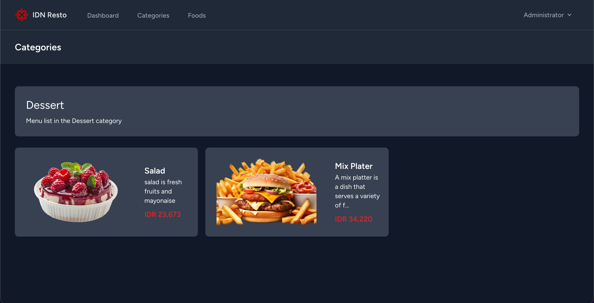
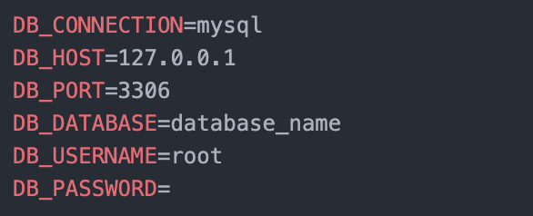

# IDN Resto
Simple Apps IDN Resto

## Fitur
All Fitur
- food category
- menu

## API

API : 

- all category : /api/category
- detail category : /api/{id}
- all food : /api/food

## highlight : 
 <br>



## How to install ? : 

1. Clone from repository 

```bash
git clone https://github.com/idn-fahmifn/microservice.git
```

2. update package

```bash
composer update
```

2. Create .env files

on mac/linux

```bash
cp .env.example .env
```

on windows

```bash
copy .env.example .env
```

3. Generate application key

```bash
php artisan key:generate
```

4. config dataabase
follow the configuration .env :  
 <br>

5. migrate database

```bash
php artisan migrate
```

6. running project

```bash
php artisan serve
```

7. install node modules

```bash
npm install
```

next

```bash
npm run dev
```


